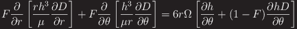
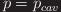

# numerical_analysis

Calculate the hydrodynamic pressure around dimples under full-film lubrication

1. Solving the Reynolds equation in cylindrical coordinates
2. Ignore surface roughness and asperity contact
3. The cavitation boundary condition follows mass-conservative JFO model

## Equation  
Reynolds equation coupled with a mass-conservative cavitation algorithm

　　For complete film zones:  
　　　,　　, 　

　　For cavitated zones:  
　　　,　　,　　

## DEMO

**Parameter**  

**Output**

|**pressure_3D_grapgh**|**pressure_2D_pressure**|**depth-pressure_graph**|
|---|---|---|
||||
