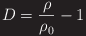

# numerical_analysis
Reynolds equation
Calculate the hydrodynamic pressure around dimples under full-film lubrication

1. Solving the Reynolds equation in cylindrical coordinates
2. Ignore surface roughness and asperity contact
3. The cavitation boundary condition follows mass-conservative JFO model

# DEMO

"hoge"の魅力が直感的に伝えわるデモ動画や図解を載せる

# Features

"hoge"のセールスポイントや差別化などを説明する
